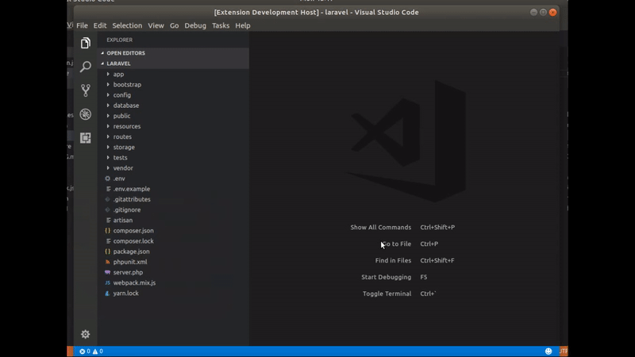

# Tinker Here

Open `artisan tinker` within [vscode](https://code.visualstudio.com/).

## Features

It's simply open the Laravel Tinker CLI. [Here's](https://scotch.io/tutorials/tinker-with-the-data-in-your-laravel-apps-with-php-artisan-tinker) a good article to show you the goodness of tinker.

## Requirements

This extension requires PHP executable file.

## Extension Settings

You don't have to register your PHP executable file into your `PATH` envvars, you can configure which PHP you want to use for tinker in:

* `tinkerHere.php`: path to your PHP executable file (full path is required).

## Known Issues

(none)

## Release Notes

### [0.0.1] - 2017-10-23
- **ADDED** Open `artisan tinker here` by @krisanalfa.
- **ADDED** Configurable path to `php` binary via `tinkerHere.php` configuration section by @krisanalfa.

**Enjoy!**